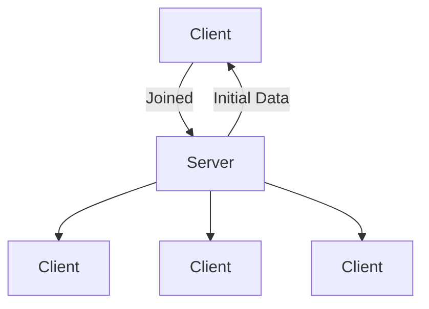

# Piw Pew
multiplayer game (2024)
## Network Events
| Event | Occurences |
|--|--|
NET_WORLD_MAP | 1
NET_WORLD_PLAYERS | 1
NET_PLAYER_JOINED | 1
NET_PLAYER_DIED | ~
NET_PLAYER_RESPAWN | ~
NET_PLAYER_KILL_REWARD | ~
NET_PLAYER_GRID_POSITION | never (forgor)
NET_PLAYER_WORLD_POSITION | t
NET_PLAYER_ORIENTATION | t
NET_PLAYER_LEFT | ~
NET_PLAYER_WEAPON_REQUEST | ~
NET_PLAYER_WEAPON_RESPONSE | ~
NET_PROJECTILE_CREATE | ~
NET_PROJECTILE_IMPACT | ~

Onces the player joins:

