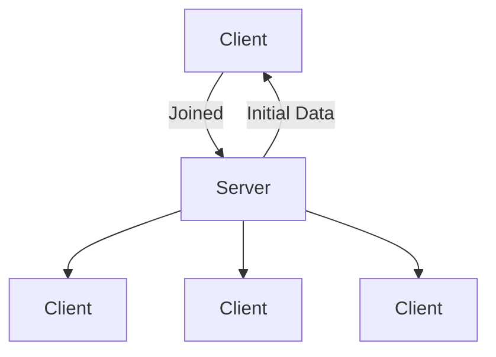

# Piw Pew
multiplayer game (2024)
## Network Events
| Occurences | Event |
|--|--|
NET_WORLD_MAP | once
NET_WORLD_PLAYERS | once
NET_PLAYER_JOINED | once
NET_PLAYER_GRID_POSITION | never (forgor)
NET_PLAYER_WORLD_POSITION | tick
NET_PLAYER_ORIENTATION | tick
NET_PLAYER_LEFT | tick
NET_PLAYER_WEAPON_REQUEST | tick
NET_PLAYER_WEAPON_RESPONSE | tick
NET_PROJECTILE_CREATE | tick
NET_PROJECTILE_IMPACT | tick

Onces the player joins:

